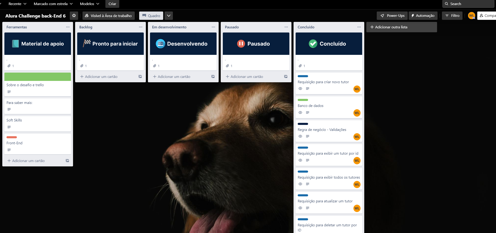

# adopet
## chaleng-back-end-6: 
## Repositório do projeto adopet da Alura Challenge Back-End 6.
Api que vai permitir o usuário criar um perfil, visualizar os pets na fila de adoção. Por sua vez, os abrigos/ONGs podem criar um perfil para os pets e concretizar a adoção.

| :placard: Vitrine.Dev | https://cursos.alura.com.br/vitrinedev/wagner-sistemalima    |
| -------------  | --- |
| :sparkles: Nome        | **chaleng-back-end-6**
| :label: Tecnologias | Kotlin, SpringBoot, Gradle
| :rocket: URL         | https://url-deploy.com.br
| :fire: Desafio     | https://www.alura.com.br/challenges/back-end-6?gclid=Cj0KCQjwiZqhBhCJARIsACHHEH8sQ3T_kqNSvWoPPpEwoUDW7vChUYgFfP2vkYnZE2FlaACqvXV-pkkaAkA5EALw_wcB

## Setup do Projeto
* Linguagem de programação: Kotlin
* Tecnologia: Spring Boot 2.7.10
* Gerenciador de dependência: Gradle
* Banco de dados: Postgres
* Java 17
* IDE IntelJ

## Metodologia kanban
* Organizar o fluxo de trabalho da 1º semana
* Sprint 1ª concluida

## Desenvolvido por:
* Wagner de Lima Braga Silva
